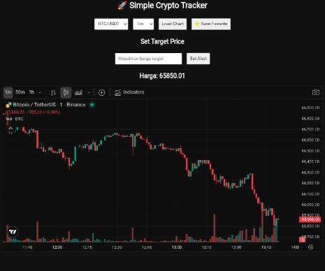

lREWARD ADDRESS: trac1u5f59uaq2pqjw9xraxdjy8tt4rgv66fhjgsh6wlcmlkce6vac8ysrwqfdq


# 🚀 Simple Crypto Tracker

Enterprise-ready lightweight cryptocurrency tracking web application built with pure frontend technologies.  
Designed for fast deployment, low resource usage, and mobile-first environments (including Termux).



---

## 📌 Overview

Simple Crypto Tracker adalah aplikasi web monitoring harga cryptocurrency berbasis browser yang memanfaatkan public API dari Binance dan widget chart dari TradingView.

Aplikasi ini dirancang untuk:

- Lightweight deployment
- No backend dependency
- Mobile-friendly usage
- Rapid setup via Termux
- Educational & prototyping purpose

---

## 🏗 Architecture

Application Type:  
> Static Frontend Application (Client-Side Only)

Data Sources:

- Binance Public REST API (Price Data)
- TradingView Widget (Chart Rendering)

Storage Layer:

- Browser LocalStorage (Favorites & Alerts)

No database, no server, no authentication required.

---

## ✨ Core Features

### 📊 Advanced Charting
- TradingView embedded chart
- Multi-timeframe selection:
  - 1m
  - 5m
  - 15m
  - 1h
  - 4h
  - 1D

### 💹 Real-Time Price Monitoring
- Price auto-refresh every 5 seconds
- Live price display

### ⭐ Favorites Management
- Save selected coin as favorite
- Stored in browser LocalStorage

### 🔔 Target Price Alert
- Set custom price target
- Automatic alert trigger when condition met

### 🌙 UI/UX
- Dark mode optimized
- Minimalist layout
- Mobile responsive

---

## 🛠 Technology Stack

| Layer        | Technology Used |
|--------------|-----------------|
| Frontend     | HTML5 |
| Styling      | CSS3 |
| Logic        | Vanilla JavaScript |
| Chart Engine | TradingView Widget |
| Market Data  | Binance Public API |
| Runtime      | Node.js (for local static server) |

---

## 📦 Installation Guide (Termux Deployment)

### 1️⃣ System Update

```bash
pkg update && pkg upgrade -y
```

### 2️⃣ Install Dependencies

```bash
pkg install nodejs git -y
```

### 3️⃣ Clone Repository

```bash
git clone https://github.com/your-username/crypto-tracker.git
cd crypto-tracker
```

### 4️⃣ Install Static Server

```bash
npm install -g serve
```

### 5️⃣ Run Application

```bash
serve .
```

Access via browser:

```
http://localhost:3000
```

---

## 📂 Project Structure

```
crypto-tracker/
│
├── index.html        # Main application
├── preview.png       # Application screenshot
└── README.md         # Documentation
```

---

## ⚙️ Functional Flow

1. User selects trading pair.
2. User selects timeframe.
3. TradingView widget loads chart dynamically.
4. Binance API fetches live price every 5 seconds.
5. If target price condition met → Alert triggered.
6. Favorite coin saved in LocalStorage.

---

## 🔐 Security Considerations

- No private API keys used
- No authentication required
- All data fetched from public endpoints
- No user data transmitted externally

---


## 🧪 Testing Strategy

Current version:
- Manual browser testing
- Mobile testing via Termux
- API response validation

Future plan:
- Unit testing (Jest)
- End-to-end testing (Cypress)
- Performance benchmarking

---

## 📈 Performance Profile

- Ultra-lightweight (single HTML file)
- No heavy frameworks
- Minimal memory footprint
- Fast initial load time
- Suitable for low-end devices


---

## 📄 License

MIT License  
Free to use, modify, and distribute.

---
